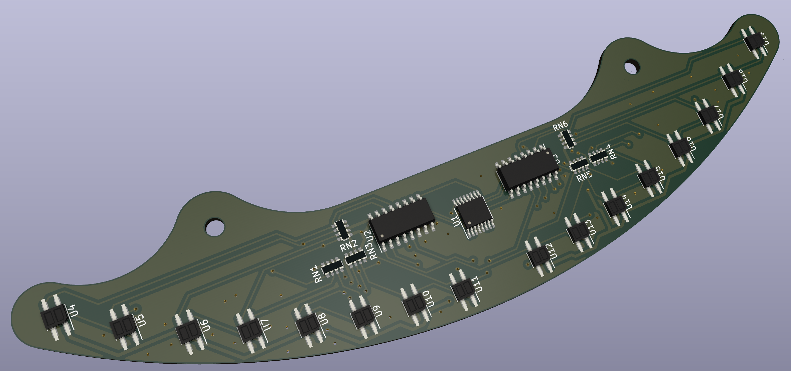

# Velocista Marrajo

Robot velocista para competición.

## Componentes Principales

- ESC 4-en-1: https://s.click.aliexpress.com/e/_DDoQeDV
- Motores Ruedas (2004 1750KV): https://es.aliexpress.com/item/1005005199386587.html
- Motor Succion (GR1404 3850KV):  https://s.click.aliexpress.com/e/_DeUeUJD
- Procesador (ESP32): https://s.click.aliexpress.com/e/_DCxmJWF
- Sensores (ITR8307): https://s.click.aliexpress.com/e/_DEY47Gr
- Rodamientos (MR128 8x12x3.5, x4): https://s.click.aliexpress.com/e/_DeULPyP
- Engranaje (7T 1.48mm): https://s.click.aliexpress.com/e/_DDH1tE3
- Engranaje (423A, x2): https://s.click.aliexpress.com/e/_DeBl3bN

## Renders

